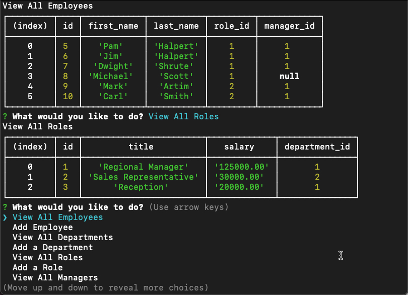

# EmployeeTracker
Unit 12 MySQL Homework: Employee Tracker

## Description
This application allows a user to maintain an emplyee database stored on server. The application is the super-modern command line interface that is all the rage here in 1979. The application allows you to view and add employees, roles and departments. 

Sample of the Employee Tracker application:  

## Table of Contents
- [Installation](#installation)
- [Usage](#usage)
- [Credits](#credits)
- [License](#license)
- [Questions](#questions)

## Installation
Clone repository and install dependencies: `npm init, npm install`

Github repsitory [NoteTaker](https://github.com/mark-artim/EmpTracker)

## Usage

This application is straightforward. Navigate the main menu and press enter on your selection.  Results will appear for viewing information or additional prompts will appear when adding new information. You can do the following:
- You are able to view all employees.
- You are able to add a new employee.
- You are able to view all departments.
- You are able to add a new department.
- You are able to view all roles.
- You are able to add a new role.

 

## Credits
I credit noone for the ill-prepartion for this project.

## License
MIT

## Features
Once you fire up your terminal and navigate to the correct directory:   
- You are able to view all employees.
- You are able to add a new employee.
- You are able to view all departments.
- You are able to add a new department.
- You are able to view all roles.
- You are able to add a new role.

## How to Contribute
If you feel web pages are a passing fad and terminal applications are making a comeback then feel free to fork and make pull requests.

## Tests
**There are no unit or other tests for this project** 

## Questions
If you have any questions please contact me at:   
**mark.artim@gmail.com**  
or visit me at  
[**Github**](https://github.com/mark-artim)
        

